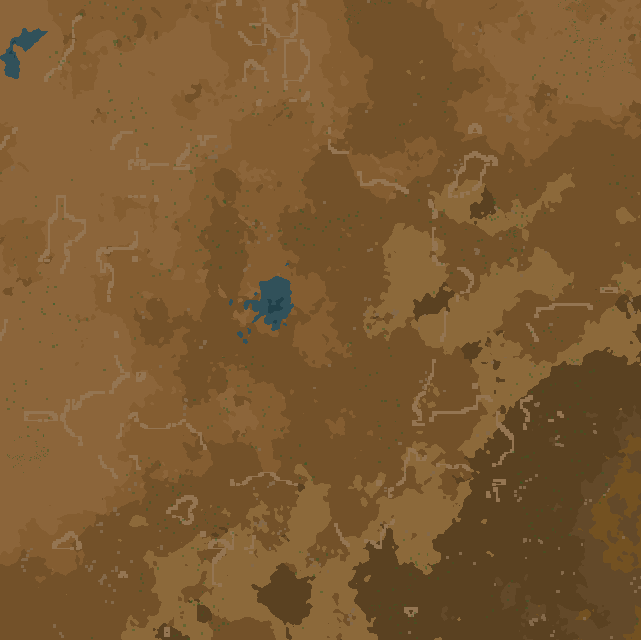

# Krastorio 2 | 1.1

Si vous voulez les fichiers de sauvegarde, il suffit d'appuyer sur le fichier qui correspond à l'épisode (YT1 = épisode 1 etc).

## Mods

- [Todo List](https://mods.factorio.com/mod/Todo-List)
- [Additional Paste Settings](https://mods.factorio.com/mod/AdditionalPasteSettings)
- [Afraid Of The Dark](https://mods.factorio.com/mod/AfraidOfTheDark)
- [Auto Deconstruct](https://mods.factorio.com/mod/AutoDeconstruct)
- [Bob's Adjustable Inserters](https://mods.factorio.com/mod/bobinserters)
- [Clean Floor](https://mods.factorio.com/mod/CleanFloor)
- [Doing Things By Hand](https://mods.factorio.com/mod/DoingThingsByHand)
- [Even Distribution](https://mods.factorio.com/mod/even-distribution)
- [EvoGUI](https://mods.factorio.com/mod/EvoGUI)
- [FNEI](https://mods.factorio.com/mod/FNEI)
- [Helmod](https://mods.factorio.com/mod/helmod)
- [Improved Research Queue](https://mods.factorio.com/mod/sonaxaton-research-queue)
- [Krastorio 2](https://mods.factorio.com/mod/Krastorio2)
- [Krastorio 2 Assets](https://mods.factorio.com/mod/Krastorio2Assets)
- [Krastorio 2 Modules Updated](https://mods.factorio.com/mod/Krastorio2_Modules_Updated)
- [Max Rate Calculator](https://mods.factorio.com/mod/MaxRateCalculator)
- [Mechanicus](https://mods.factorio.com/mod/Mechanicus)
- [Modular Chests](https://mods.factorio.com/mod/LB-Modular-Chests)
- [Nanobots: Early Bots](https://mods.factorio.com/mod/Nanobots)
- [Noxys Waterfill](https://mods.factorio.com/mod/Noxys_Waterfill)
- [P.U.M.P.](https://mods.factorio.com/mod/pump)
- [Resource Spawner Overhaul](https://mods.factorio.com/mod/rso-mod)
- [Squeak Through](https://mods.factorio.com/mod/Squeak%20Through)
- [Time Tools](https://mods.factorio.com/mod/TimeTools)
- [Wire Shortcuts](https://mods.factorio.com/mod/WireShortcuts)

## Episodes

- [Episode 1](https://youtu.be/7k5mP7MPXvg)
- [Episode 2](https://youtu.be/Jjp3ZQPx9ow)
- [Episode 3](https://youtu.be/DbARAEqXlfw)



```
>>>eNpjZGBksGaAAHsGhgP23CzJ+Yk5DAwOYB4IcyXnFxSkFunmF6Ui
C3MmF5WmpOrmZ6IqTs1Lza3UTUosBipusIdhjszc1KLizBIUEzgyi/L
z0I3lzc3MSy1KzNEtTyxJLUKW4S5KLErVzU0tScwpRhZnLS7Jz0Mxg7
WkKDW1GNl+7tKixLzM0lx02xgYPb6K/WtokWMA4f/1DAr//4MwkPUAG
CIgzMDYAFEJFIMB1uSczLQ0BgYFRyB2AlnAyMhYLbLO/WHVFHtGiBo9
ByjjA1TkQBJMxBPG8HPAKaUCY5ggmWMMBp+RGBBLS4BWQFVxOCAYEMk
WkCQj4/Z4u0jDmLN2jL/qsvaUTM6wZ/RYv2fWp+tVdkBJdpA/meDErJ
kgsBPmFQaYmQ/soVI37RnPngGBN/aMrCAdIiDCwQJIHPBmZmAU4AOyF
vQACQUZBpjT7GDGiDgwpoHBN5hPHsMYl+3R/QEMCBuQ4XIg4gSIAFsI
dxkjhOnQ78DoIA+TlUQoAeo3YkB2QwrChydh1h5Gsh/NIZgRgewPNBE
VByzRwAWyMAVOvGCGuwYYnhfYYTyH+Q6MzCAGSNUXoBiEB5KBGQWhBR
zAwc3MgAAf7Bmeqx9tBgCPSLa2<<<
```